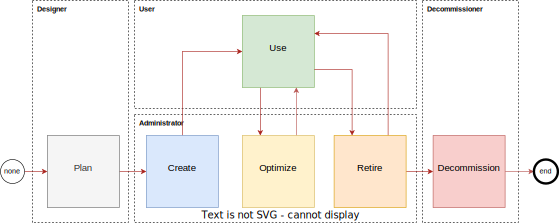

# Contents
* [Overview](#overview)
* [OCI access controls](#oci-access-controls)
* [Real life organizations create complexity](#real-life-organizations-create-complexity)
* [Keep it simple](#keep-it-simple)
* [Access privileges](#access-privileges)/[Privilege cluster](#privilege-cluster)
* [Operating model](#operating-model)
* [Features](#features)
* [Tools](#tools)
* [Quick start](#quick-start)

# Overview
Crystal@IAM project simplifies OCI access controls configuration using Excel table as an configuration interface, where you mark OCI resources access level for specified user groups. Once completed access model is automatically converted to OCI access policies, by logic coded in a bash script.

Crystal@IAM project:
- maps user groups to resources with privileges specified on fine grained level
- maps user groups to resources with privileges specified on clustered level
- supports resources at the tenancy level
- supports resources at the compartment level
- supports up to four resource's parameters

# OCI access controls
Oracle Cloud Infrastructure is equipped with state-of-the-art access control features. The organization of resources among tenancies and compartments is unique in the industry, enabling the virtual modeling of real-life data centers with features such as data halls, hardware cages, demarcation points, etc. Furthermore, sophisticated access control for special use cases can be achieved through tag-based access policies.

The effectiveness of access controls derives from straightforward access statements that define the actual access rights to resources or resource families for access groups of users or machines.

Access to OCI resources is defined using four simple actions: inspect, read, use, and manage, used in human readable simple text format to define who may do what in a given location. Sounds simple, and indeed it's so simple. Additional extra features come from possibility to influence access statements by conditions, what opens OCI access controls for a wide range of customizations.

Each OCI resource supports above profile implementing top level verbs by more specific privileges to finally map them to API calls. Apart from general variables, OCI resources exposes private ones. All the variables that may be used in conditions part of the policy statements, are actual enablers of access control fine tuning leading to customizations.

Each OCI resource has its own set of privileges, which must be defined and assigned to access groups through access policies. These assignments should reflect the distribution of responsibilities and security aspects within the organization of the tenancy owner. 

# Real life organization creates complexity
Single person system is simple. Small team utilizing cloud resources is easy to handle, however even the smallest one should follow best practices to avoid surprises like deleting block volumes with all the backups. It's so easy to be done in the Cloud! Enterprise class organization adds to this additional complexity 

Finally setting up access controls in the proper way using traditional means is a very complex task.

# Keep it simple
Engineering knows how to deal with complex tasks. The answer is in splitting complexity into simpler tasks, and combine them back together. 

It's simple to say that:
- development team may use bastion in dev compartment
- system team administers database resources in system compartment
- network engineers administers local network (without access to Internet)

It's much simpler that copy / pasting series of statements from documentation, additionally manually adding protection against resource deletion (as recommended by CIS benchmark) or disabling access to non local network resources.

Crystal@IAM makes it simpler by resource access templates, access clusters, and Excel based interface to model access privileges. 

# Access privileges
Crystal@IAM comes with a general approach that administrator may create, optimize, and retire resources but cannot delete them. Anyone who at least once deleted volume or file system w/o taking backup knows how it is. Resource creation does not lead to disruption, but deletion by mistake does. 

Crystal@IAM enables OCI tenants to model resource life-cycle based on admin/use/decommission approach, where three major access rights are promoted: admin, use, and decommission. Other of course are sill available for use when needed; especially for break-glass access with crude manage privilege.



Crystal@IAM supports superset of OCI IAM privileges:

| access | code | description |
| -----  | ---- | ----------- |
|create|C|permission to create resource
|use|U|permission to use the resource on control plane level. Does not cover TCP level exposed by the resource itself i.e. does not cover data plane permissions.
|optimise|O|permission to tune resource on control plane level. Does not cover software level tuneables exposed by the resource itself i.e. does not cover data plane tunning permissions.
|retire|R|remove from use
|decommission|D|permission to decommission resource on a control plane level. Does not cover data plane permissions related to protecting data kept by software behind there resource
|inspect|I|permission to inspect state of the resource at control plane level. Does not cover access to business data handled by the resource.
|manage|M|full permission to the resource and inner resources incl. delete. Should be used only by break glass roles.

As you see it little differs from regular OCI's: inspect, read, use, and manage, however is similar to internal privileges: CREATE, INSPECT, USE, UPDATE, DELETE, and MOVE. 

## Privilege cluster
Access levels may be clustered together for simplicity. Highly restrictive organization may need to maintain dedicated deployer role, however it's good enough to set admin users with COR privilege cluster, what means that administrators amy create, optimize, adn retire resources. Having the clusters, access statements used to generate policies are simpler, as COR may be implemented in a very simple way. Finally it leads to saving policy statements in access policy, what is a limited resource in the OCI.

# Operating model
Crystal@IAM operating model is presented on the following diagram.


# Features
(draft)
* Access rights may be grouped into clusters to optimize statements e.g. COR means admin.
* Policy profile may be commented using # character at front of the comment. Comments are full line only.
* Policy verb may be not defined for some resources e.g. cloud-shell is use-only. Not supported verbs are handled by Crystal@IAM by recognizing not_supported file extension.
* support for compartment prefix incl. multilevel compartments notation cmp1:cmp2

# Tools
Crystal@IAM comes with:
- Excel file to define user2resource access matrix
- OCI resource access policies profile for for grained and clustered access rights
- bash script to convert Excel model into text files with OCI access policies

# Quick start

To make it easy change directory to Crystal@IAM project directory.
```
cd Crystal_AIM
```

Look into one of already generated access policies
```
cat ./out/compute_admin
```

Look into admin/use policy templates for tag namespace, kubernetes, compute instance, volume, volume backup, and file system, which are used to build compute_admin access policy.
```
cat ./profiles/v0.2/kubernetes/admin
cat ./profiles/v0.2/instance/admin
cat ./profiles/v0.2/iam_tag_namespaces/admin 
cat ./profiles/v0.2/volume_backup/use  
cat ./profiles/v0.2/volume/use  
cat ./profiles/v0.2/file_system/use 
```

Now you know how resource access statements templates are combined into the final access policy.

Now perform conversion of already available demo csv file. It will take some time.
```
./bin/access_list.sh ./data/access_list_v5.csv 
ls out
```

Now you are ready to perform conversion of provided demo xls file, and generation of access policies. Note you need to install sscovert which comes with gnumeric package.

```
ssconvert ./data/access_list_v5.xlsx ./tmp/access_list_v5.csv 
./bin/access_list.sh ./tmp/access_list_v5.csv 
ls out
```


# Author
rstyczynski@gmail.com, https://github.com/rstyczynski/Crystal_IAM

version 0.1 (prototype)
