# Contents
* [Overview](#overview)
* [OCI access controls](#oci-access-controls)
* [Real life organizations create complexity](#real-life-organizations-create-complexity)
* [Keep it simple](#keep-it-simple)
* [Access privileges](#access-privileges)/[Privilege cluster](#privilege-cluster)
* [Operating model](#operating-model)
* [Features](#features)
* [Tools](#tools)
* [Quick start](#quick-start)
* [How to use the spreadsheet](#wow-to-use-the-spreadsheet)
* [How to model policy templates](#how-to-model-policy-templates)

# Overview
Crystal@IAM project simplifies OCI access controls configuration using Excel table as an configuration interface, where you mark OCI resources access level for specified user groups at specified compartment. Once completed the access model is automatically converted to OCI access policies, by 350 lines long logic coded in a bash script. The outcome of combining spreadsheet data with, prebuilt for each OCI resource, template policies is set of an OCI access policies. 

You are free to build your own profile with templates, when proposed template scheme does not fit into your use case.

Crystal@IAM give you freedom to combine any number of atomic policy statements in each template; you can even build your own resource group names - like OCI AIM families e.g. to model access to internal and external network communication resources.

Crystal@IAM project:
- provides graphical interface to to map access groups to resources on desired compartment level
- supports access policy attachment at desired level
- gathers AIM level privileges into multi resource clusters to simplify modeling of resources 
- maps user groups to resources with privileges specified on fine grained level
- maps user groups to resources with privileges specified on clustered level
- supports up to four resource's parameters, to be used in templates

# OCI access controls
Oracle Cloud Infrastructure is equipped with state-of-the-art access control features. The organization of resources among tenancies and compartments is unique in the industry, enabling the virtual modeling of real-life data centers with features such as data halls, hardware cages, demarcation points, etc. Furthermore, sophisticated access control for special use cases can be achieved through tag-based access policies.

The effectiveness of access controls derives from straightforward access statements that define the actual access rights to resources or resource families for access groups of users or machines.

Access to OCI resources is defined using four simple actions: inspect, read, use, and manage, used in human readable simple text format to define who may do what in a given location. Sounds simple, and indeed it's so simple. Additional extra features come from possibility to influence access statements by conditions, what opens OCI access controls for a wide range of customizations.

Each OCI resource supports above profile implementing top level verbs by more specific privileges to finally map them to API calls. Apart from general variables, OCI resources exposes private ones. All the variables that may be used in conditions part of the policy statements, are actual enablers of access control fine tuning leading to customizations.

Each OCI resource has its own set of privileges, which must be defined and assigned to access groups through access policies. These assignments should reflect the distribution of responsibilities and security aspects within the organization of the tenancy owner. 

# Real life organization creates complexity
Single person system is simple. Small team utilizing cloud resources is easy to handle, however even the smallest one should follow best practices to avoid surprises like deleting block volumes with all the backups. It's so easy to be done in the Cloud! Enterprise class organization adds to this additional complexity 

Finally setting up access controls in the proper way using traditional means is a very complex task.

# Keep it simple
Engineering knows how to deal with complex tasks. The answer is in splitting complexity into simpler tasks, and combine them back together. 

It's simple to say that:
- development team may use bastion in dev compartment
- system team administers database resources in system compartment
- network engineers administers local network (without access to Internet)

It's much simpler that copy / pasting series of statements from documentation, additionally manually adding protection against resource deletion (as recommended by CIS benchmark) or disabling access to non local network resources.

Crystal@IAM makes it simpler by resource access templates, access clusters, and Excel based interface to model access privileges. 

# Access privileges
Crystal@IAM comes with a general approach that administrator may create, optimize, and retire resources but cannot delete them. Anyone who at least once deleted volume or file system w/o taking backup knows how it is. Resource creation does not lead to disruption, but deletion by mistake does. 

Crystal@IAM enables OCI tenants to model resource life-cycle based on admin/use/decommission approach, where three major access rights are promoted: admin, use, and decommission. Other of course are sill available for use when needed; especially for break-glass access with crude manage privilege.


Crystal@IAM supports superset of OCI IAM privileges:

| access | code | description |
| -----  | ---- | ----------- |
|create|C|permission to create resource
|use|U|permission to use the resource on control plane level. Does not cover TCP level exposed by the resource itself i.e. does not cover data plane permissions.
|optimise|O|permission to tune resource on control plane level. Does not cover software level tuneables exposed by the resource itself i.e. does not cover data plane tunning permissions.
|retire|R|remove from use
|decommission|D|permission to decommission resource on a control plane level. Does not cover data plane permissions related to protecting data kept by software behind there resource
|inspect|I|permission to inspect state of the resource at control plane level. Does not cover access to business data handled by the resource.
|manage|M|full permission to the resource and inner resources incl. delete. Should be used only by break glass roles.

As you see it little differs from regular OCI's: inspect, read, use, and manage, however is similar to internal privileges: CREATE, INSPECT, USE, UPDATE, DELETE, and MOVE. 

## Privilege cluster
Access levels may be clustered together for simplicity. Highly restrictive organization may need to maintain dedicated deployer role, however it's good enough to set admin users with COR privilege cluster, what means that administrators amy create, optimize, adn retire resources. Having the clusters, access statements used to generate policies are simpler, as COR may be implemented in a very simple way. Finally it leads to saving policy statements in access policy, what is a limited resource in the OCI.

# Operating model
Crystal@IAM operating model is presented on the following diagram.




# Features
(draft)
* Access rights may be grouped into clusters to optimize statements e.g. COR means admin.
* Policy profile may be commented using # character at front of the comment. Comments are full line only.
* Policy verb may be not defined for some resources e.g. cloud-shell is use-only. Not supported verbs are handled by Crystal@IAM by recognizing not_supported file extension.
* support for compartment prefix incl. multilevel compartments notation cmp1:cmp2

# Tools
Crystal@IAM comes with:
- Excel file to define user2resource access matrix
- OCI resource access policies profile for for grained and clustered access rights
- bash script to convert Excel model into text files with OCI access policies

# Quick start

To make it easy change directory to Crystal@IAM project directory.
```
cd Crystal_IAM
```

Look into one of already generated access policies
```
cat ./out/compute_admin
```

Look into admin/use policy templates for tag namespace, kubernetes, compute instance, volume, volume backup, and file system, which are used to build compute_admin access policy.
```
cat ./profiles/v0.2/kubernetes/admin
cat ./profiles/v0.2/instance/admin
cat ./profiles/v0.2/iam_tag_namespaces/admin 
cat ./profiles/v0.2/volume_backup/use  
cat ./profiles/v0.2/volume/use  
cat ./profiles/v0.2/file_system/use 
```

Now you know how resource access statements templates are combined into the final access policy.

Now perform conversion of already available demo csv file. It will take some time.
```
export out_timestamp=no
./bin/ciam.sh ./data/ciam_model_v6.csv 
ls policies
```

Now you are ready to perform conversion of provided demo xls file, and generation of access policies. Note you need to install sscovert which comes with gnumeric package.

```
export out_timestamp=no
ssconvert ./data/ciam_model_v6.xlsx ./tmp/ciam_model_v6.csv 
./bin/ciam.sh ./tmp/ciam_model_v6.csv 
ls policies
```

You can generate access policy for just one access group; possibly for testing purposes.

```
export out_timestamp=no
export access_groups=network_admin
ssconvert ./data/ciam_model_v6.xlsx ./tmp/ciam_model_v6.csv 
./bin/ciam.sh ./tmp/ciam_model_v6.csv 
cat ./policies/tenancy/network_admin
```

# How to use the spreadsheet
The spreadsheet's rows represent business divisions and access groups. The access groups are always prefixed by a dash '-' and the business divisions serve as a logical grouping. You are free to add new rows using the regular spreadsheet's 'insert row' operation. Please ensure that new rows are always added above the one labeled '(new row? Always insert above this line)'.

## location
Columns represent OCI compartment, and resource. Notice notation with slash after compartment - it's a way to pass parameter to template engine. Not really used for locations, however useful for resources. Compartments use regular OCI notation with colon ':' to specify sub-compartment. 

Note that sub compartments are always provided from root, so in case of specifying special access to sub-compartments you must use colon notation.

## policy attachment
OCI access policy may be attached at any compartment. It's an interesting feature as it creates possibility to establish autonomic compartments with ability to manage local policies. Crystal@IAM supports policy attachment by exposing attach at compartment column in the spreadsheet. 

Notice that the same policy may be attached at tenancy or other compartment. Spreadsheet requires you to provide each 'location' using a full path from root. Such full location will be cut into the proper format once other compartment is specified as an attachment point.

## resource
Resources are typically regular names of OCI resources, however actual name used in the spreadsheet is the name from profile/$version directory. Look into this directory to familiarize yourself with resource catalogue provided with used release of Crystal@AIM. 

Resource may be provided with up to four parameters, which are specified after '/' and separated by '|'. Below example specifies access to tag_cost-tracking tag namespace.

```
iam_tag_namespaces / tag_cost-tracking
```

## access rights
Spreadsheet's cell crossing between access group and location / resource name is a place to specify access code. You may specify access letters as specified in the following table.

| access | code | description |
| -----  | ---- | ----------- |
plan|P|authority to make decision about resource configuration	
create|C|permission to create resource	
use|U|permission to use the resource on control plane level. Does not cover TCP level exposed by the resource itself i.e. does not cover data plane permissions.	
optimise|O|permission to tune resource on control plane level. Does not cover software level tunnelables exposed by the resource itself i.e. does not cover data plane tunning permissions.	
retire|R|remove from use	
decommission|D|permission to decommission resource on a control plane level. Does not cover data plane permissions related to protecting data kept by software behind there resource	
inspect|I|permission to inspect state of the resource at control plane level. Does not cover access to business data handled by the resource.	
manage|M|full permission to the resource and inner resources incl. delete. Should be used only by break glass roles.	

You can specify any combination of above letters. Notice that this version of Crystal@AIM provides support of COR cluster, meaning administrator who can create, optimize, and retire, but cannot delete. Providing COR cluster makes it easy to model access statement, as it's not combined from three access templates, but admin one is used instead.

## access coverage helper
At the bottom row, under space for access configuration, you see line with 'Missing privileges (Ctrl-S so see):' label, where missing privileges are listed. This is a support tool to spot potentially missing access rights. It may be not a problem to omit some access rights, as some use cases may be always supported by break-glass procedure, and this line aim to just help in access modeling.

## header rows
Attention! Do not modify rows above the header row. The logic assumes that the header starts at a specific row number and the data follows. While this is parameterized in the logic, there is no need to alter it.

# How to model policy templates
Crystal@AIM is based on trivial templates. Admin privileges for a file system looks the following:

```
cat ./profiles/v0.2/file_system/admin

# https://docs.oracle.com/en-us/iaas/Content/Identity/Reference/filestoragepolicyreference.htm

allow group $GROUP to manage file-family in $LOCATION
where request.permission!=/*_DELETE/
```

As you see resource's actions are presented as regular IAM policy statements, with intended extra conditions and parameters. Above example use two basic parameters: group, and location. Notice one more extension - possibility add comments; comments are always single line.

Each action may consist of multiple statements, what is different from regular IAM syntax. Good example of such complex policy is an OCI Bastion service. 

```
cat ./profiles/v0.2/file_system/admin/Users/rstyczynski/projects/Crystal_IAM/profiles/v0.2/bastion/create

# https://docs.oracle.com/en-us/iaas/Content/Bastion/Reference/bastionpolicyreference.htm

# NOTE: It's not clear why CREATE requires DELETE on network, 
#       but w/o DELETE it was not possible to create the bastion
allow group $GROUP to manage all-resources in $LOCATION
where all {
	any {
		request.permission='BASTION_INSPECT',
		request.permission='BASTION_CREATE',
		request.permission='VNIC_ATTACHMENT_READ', 
		request.permission=/VNIC_*/,
		request.permission=/PRIVATE_IP_*/,
		request.permission=/VCN_*/, 
		request.permission=/SUBNET_*/,
		request.permission=/ROUTE_TABLE_*/, 
		request.permission=/NETWORK_SECURITY_GROUP_*/, 
		request.permission=/SECURITY_LIST_*/	
	}
}

# Note: there must be a separate bastion for each compartment
allow group $GROUP to read instance-family in $LOCATION
allow group $GROUP to read instance-agent-plugins in $LOCATION
allow group $GROUP to inspect work-requests in $LOCATION
```

Templates support up to four resource level parameters. Note the fixed name of the parameters.

```
cat ./profiles/v0.2/iam_tag_namespaces/admin

# https://docs.public.oneportal.content.oci.oraclecloud.com/en-us/iaas/Content/Identity/policyreference/iampolicyreference.htm#top

allow group $GROUP to manage tag-namespaces in $LOCATION
where all {
	request.permission!=/*_DELETE/,
	any {
		request.permission='TAG_NAMESPACE_*'
	},
	target.tag-namespace.name='$RESOURCE_P1'
}
```

Some resources, by definition, do not have full list of permissions available. One of examples is Cloud Shell.

```
ls ./profiles/v0.2/cloud_shell
admin.not_supported
inspect.not_supported
read.not_supported
create.not_supported
manage.not_supported
retire.not_supported
decommission.not_supported
optimise.not_supported
use
```

Each resource comes with (to be done) required tenancy level permissions as specified by OCI resource documentation. 

```
TODO
```

Resource templates are gathered together in a directory, which is a policy set name. Second level directory is a resource name, what you see from above examples.

## template parameters
Parameters is the templates are always provided as uppercase with $ sign at the beginning. Crystal@IAM supports following parameters:

| parameter | description |
| ----- | ----------- |
|$GROUP|IAM access group name |
|$LOCATION|location provided as tenancy or compartment|
|$RESOURCE_P1|resource's 1st parameter|
|$RESOURCE_P2|resource's 2nd parameter|
|$RESOURCE_P3|resource's 3rd parameter|
|$RESOURCE_P4|resource's 4th parameter|
|$COST_USAGE_TENANCY_OCID|cost and usage tenancy identifier|

## policy count optimization
OCI limits number of access policies, and number of policy statements inside of the access policy. Optimization of the number of access policy  is subject for further extension of Crystal@IAM (L40). Optimization of policy statements is implemented by clustering access rights e.g. COR ia a single template admin instead of three individual for Create, Optimize, and Retire. You can further optimize number of policy statements in your templates using IAM access policy logical syntax, knowing that individual policy statements are always executed as an alternative.

Such two access statements for :

```
allow group $GROUP to manage virtual-network-family in $LOCATION
where all {
            request.permission!=/*_DELETE/,
            any {
                request.permission=/NETWORK_SECURITY_GROUP_*/,
                request.permission=/SECURITY_LIST_*/
            }
        }

allow group $GROUP to manage virtual-network-family in $LOCATION
where all {
            any {
                request.permission=/*_READ/,
                request.permission='VCN_ATTACH'
            },
            request.permission=/VCN_*/
        }
```

may be implemented as one.

```
allow group $GROUP to manage virtual-network-family in $LOCATION
where any {
        all {
            request.permission!=/*_DELETE/,
            any {
                request.permission=/NETWORK_SECURITY_GROUP_*/,
                request.permission=/SECURITY_LIST_*/
            }
        }, 
        all {
            any {
                request.permission=/*_READ/,
                request.permission='VCN_ATTACH'
            },
            request.permission=/VCN_*/
        }
    }
```

# Testing policies
## OCI Console
OCI Console typically requires more privileges that required as Console shows context of the resource. Manual testing is required to spot missing privileges.

Note that after policy change, it's required to reload OCI Console page several times. Good step is to remove all browsing history, before performing the final verification.

## CLI
TODO

# Known problems
## MANAGE is not always superset of lower privileges
When resource does not implement MANAGE privilege, you must specify the lower one that is supported. Example: cloud-guard-recommendations which supports only INSPECT

# Author
rstyczynski@gmail.com, https://github.com/rstyczynski/Crystal_IAM

version 0.1 (prototype)